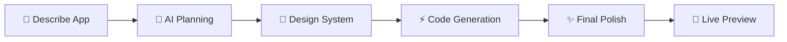

# 🎨 Craftopia

**Transform your ideas into functional web applications using the power of AI**

Craftopia is a iOS application that bridges the gap between conceptual ideas and functional prototypes. Simply describe your vision in natural language, and watch as AI transforms it into a complete, interactive HTML application with beautiful design.

## ✨ Key Features

### 🤖 **Multi-Agent AI Pipeline**
- **4-Stage Generation Process**: Planner → Themer → Coder → Reviewer
- **Specialized AI Models**: Different models optimized for specific tasks
- **Intelligent Orchestration**: Seamless coordination between agents

### 🎨 **Soft UI / Flat 2.0 Design System**
Craftopia features a meticulously crafted design system inspired by modern Apple aesthetics:

#### **Visual Language**
- **Soft Shadows**: Multi-layered shadows (0 2px 6px → 0 12px 24px) for depth without heaviness
- **Subtle Gradients**: 2-4% brightness variations for sophisticated surfaces
- **Generous Corner Radius**: 10-16px for modern, approachable feel
- **Premium Spacing**: 16-24px padding for breathing room

#### **Color Palette**
```
Light Theme:
├── Background: #F5F6F8 (Soft neutral base)
├── Surface: #FFFFFF (Pure white containers)
├── Primary: #186DEE → #1B77FD (Dynamic blue gradient)
├── Borders: #E3E6EB (Subtle separation)
└── Text: #131B22 → #4B5669 → #99A1B3 (Hierarchy)

Dark Theme:
├── Background: #07090D (Deep space)
├── Surface: #15171F → #0C0E12 (Elevated surfaces)
├── Borders: #3A3A3C (Refined separation)
└── Text: #FFFFFF → #EBEBF5 → #8E8E93 (Clarity)
```

#### **Component System**
- **Buttons**: Gradient backgrounds + soft shadows + 44px minimum touch targets
- **Cards**: Surface gradients + elevation shadows + 16px corner radius
- **Inputs**: Inset shadows + focus states + consistent 16px padding
- **Glass Effects**: Adaptive blur materials for overlays

### 🚀 **Instant Prototyping**
- **Natural Language Input**: Describe apps in plain English
- **Real-time Generation**: Watch your ideas come to life
- **Live Preview**: WebView integration with secure rendering
- **One-Click Export**: Save generated HTML applications

### 🏗️ **Clean Architecture**
```
┌─ Presentation Layer ─────────────────┐
│  SwiftUI Views + Components          │
├─ Business Logic Layer ───────────────┤
│  GenerationService + Agent Clients   │
├─ Data Layer ─────────────────────────┤
│  GenerationStore + State Management  │
└─ External Services ──────────────────┘
   Multi-Provider AI APIs
```

### 🔒 **Security & Privacy**
- **Secure Keychain Storage**: API keys protected with iOS Keychain
- **Content Sanitization**: XSS protection for generated HTML
- **Local Processing**: No data retention on external servers
- **Build-time Configuration**: Secure credential management

## 🛠️ Technology Stack

### **Frontend**
- **SwiftUI**: Modern declarative UI framework
- **Combine**: Reactive programming for state management
- **WebKit**: Secure HTML rendering

### **AI Integration**
- **Cerebras AI**: High-performance language models
- **Multi-Model Architecture**: Specialized models for different tasks
- **Streaming Responses**: Real-time generation feedback

### **Architecture Patterns**
- **MVVM**: Model-View-ViewModel with reactive bindings
- **Dependency Injection**: Clean separation of concerns
- **Unidirectional Data Flow**: Predictable state management

## 📱 User Experience

### **Generation Flow**


### **Multi-Agent Pipeline**
1. **Planner Agent**: Analyzes requirements and creates detailed specifications
2. **Themer Agent**: Generates design tokens and visual system
3. **Coder Agent**: Implements functional HTML with the design system
4. **Reviewer Agent**: Performs final optimization and bug fixes

## 🚀 Getting Started

### **Prerequisites**
- Xcode 15.0+
- iOS 15.0+
- Swift 5.9+

### **Setup**
1. Clone the repository:
```bash
git clone https://github.com/yourusername/craftopia.git
cd craftopia
```

2. Configure API keys:
```bash
cp Config-Template.xcconfig Config.xcconfig
# Edit Config.xcconfig with your API keys
```

3. Open in Xcode:
```bash
open Craftopia.xcodeproj
```

4. Build and run on simulator or device

### **API Configuration**
Create a `Config.xcconfig` file with your API credentials:
```
// Cerebras AI API Configuration
CEREBRAS_API_KEY = your_api_key_here
CEREBRAS_BASE_URL = https://api.cerebras.ai/v1
```

## 🎯 Example Prompts

Transform these ideas into functional apps:

```
🧮 "Create a beautiful calculator with a modern design"
✅ "Build a todo list with add, edit, and delete functionality"
🎮 "Design a memory card matching game"
📊 "Make a expense tracker with categories"
🎨 "Create a color palette generator tool"
```

## 🏗️ Project Structure

```
Craftopia/
├── 📱 App/
│   ├── CraftopiaApp.swift          # App entry point
│   └── ContentView.swift           # Root view
├── 🎨 Views/
│   ├── GenerateScreen/             # Main generation interface
│   ├── SettingsView/               # Configuration & preferences
│   ├── Components/                 # Reusable UI components
│   └── StatusView/                 # Generation status feedback
├── 🤖 API/
│   ├── PlannerAgentAPIClient.swift # Specification generation
│   ├── ThemerAgentAPIClient.swift  # Design system creation
│   ├── CoderAgentAPIClient.swift   # Code implementation
│   └── ThinkingAgentAPIClient.swift # Final review & polish
├── 🧠 Services/
│   ├── GenerationService.swift     # AI orchestration
│   └── AgentLoggingService.swift   # Debug & analytics
├── 📊 Store/
│   └── GenerationStore.swift       # State management
├── 🗂️ Models/
│   └── GenerationState.swift       # Data structures
└── 🎨 Design/
    └── DesignStyle.md              # Design system documentation
```

## 🎨 Design Philosophy

Craftopia embodies the **Soft UI (Flat 2.0)** design philosophy:

### **Core Principles**
- **Functional Beauty**: Every element serves a purpose
- **Gentle Hierarchy**: Soft shadows and gradients create depth
- **Tactile Interaction**: Buttons feel pressable, surfaces feel real
- **Adaptive Design**: Seamless light/dark mode transitions

### **Implementation Guidelines**
- Multi-layered shadows for realistic depth
- CSS custom properties for theme switching
- Generous spacing for premium aesthetic
- Sophisticated hover states with smooth transitions

## 🔧 Advanced Features

### **Agent Logging System**
- Comprehensive session tracking
- Performance metrics and debugging
- Timestamped markdown logs in `~/Documents/AgentLogs/`

### **Theme Adaptation**
- Automatic system theme detection
- Manual theme override
- Dynamic material effects (glassmorphism)

### **Security Measures**
- XSS protection in generated content
- Secure API key storage
- Content sanitization
- Build-time credential injection

## 🤝 Contributing

We welcome contributions! Please read our contributing guidelines and code of conduct.

### **Development Setup**
1. Fork the repository
2. Create a feature branch
3. Follow the existing code style
4. Add tests for new functionality
5. Submit a pull request

*Transform your imagination into reality with AI-powered prototyping*